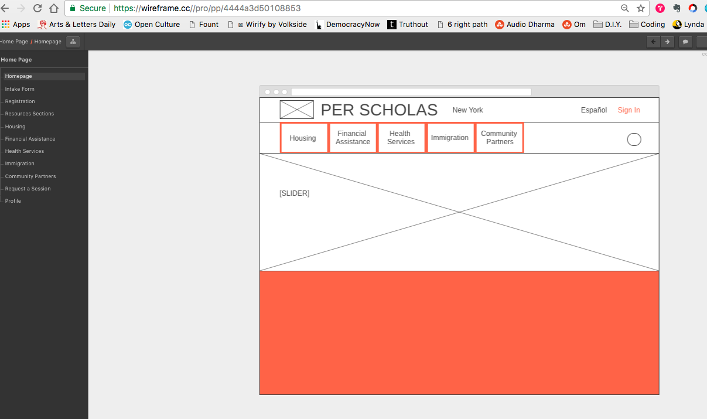

# CodeBridge Final by Kai Zhang

A student resource page built for Per Scholas social worker to more efficiently communicate social and financial resources.

Mobile responsive and built with pixel-perfect precision to blend in with the Per Scholas website, brand, and style guide. I also created icons on Adobe Illustrator and Photoshop to match the Per Scholas iconography.

I will be building a full stack version of this site, with an intake form, login, student accounts and database, as my third project at General Assembly. In the meantime, here is what the project looks like at this stage: http://kaizen-final.bitballoon.com

-----
-----

## Resources for students in NYC: 
Categorized and ordered according to what Per Scholas social worker, Claire Cuno, said were the issues students most frequently need support with: http://kaizen-final.bitballoon.com/resources

Before creating the website, surveys were conducted with students from Cohort 5 of Per Scholas. An in-depth interview was conducted with Claire Cuno, the social worker at Per Scholas, to inquire as to which services would be most pragmatically helpful for her. 

## Wireframes

Wireframes were created mainly by hand, and also digitally on wireframes.cc :

This is stage one of a lengthier software development lifecycle. For now, I am using Google Forms to store student data in the form of an Excel table. I hope the next iteration of this project will include creating a backend server where the data can be stored, user pages with logins could be created, and the site could have a functional member section only accessible after login. I am fully intent on creating a functional software product that Claire could use at Per Scholas by the end of G.A. and then to test, debug, and improve this product with Claire's help in the months following CodeBridge.
